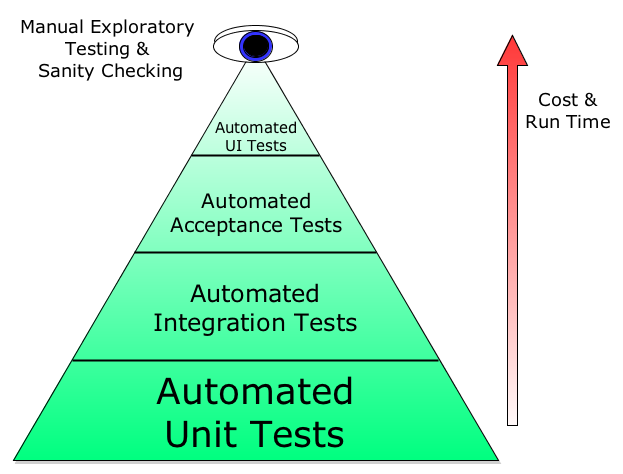
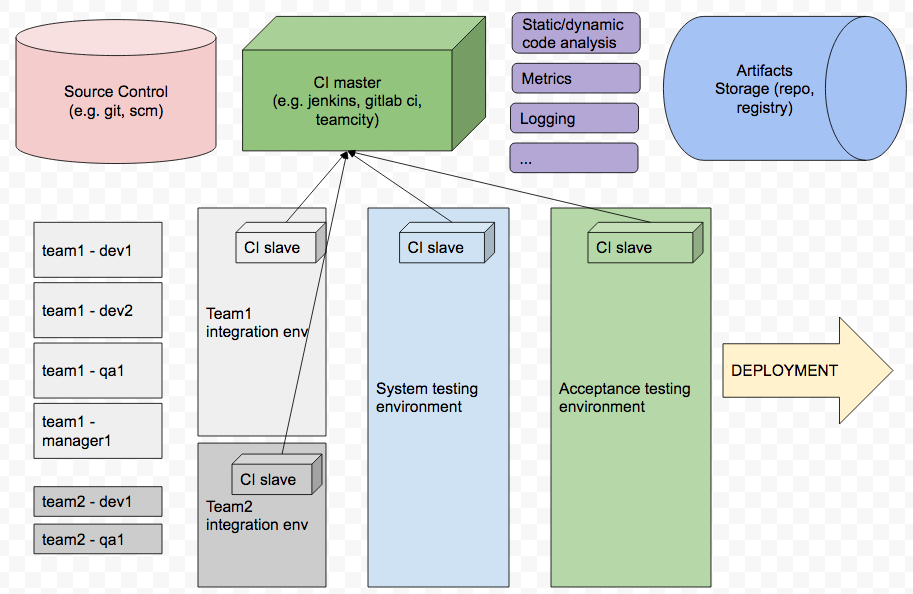

## CI
Continuous Integration is a software development practice where members of a team integrate their work frequently, 
usually each person integrates at least daily - leading to multiple integrations per day. 
Each integration is verified by an automated build (including test) to detect integration errors as quickly as possible. 
Many teams find that this approach leads to significantly reduced integration problems and allows a team to develop cohesive software more rapidly. 

## CI practices

- Single Source Repository
- Automate the Build
- Test automation
- Mainline over multi-branch, short-lived Branches
- Fix Broken Builds Immediately
- Independent Build from the IDE
- Keep the Build Fast
- Visible response
- Pipeline
- Protected Configuration
- Single Command Environment 
- Check styling and NFR
- External artifact storage

## DevOps testing involvement

#### DevOps should work tightly with QA to establish nearly real-time quality response
- Unit testing
- Integration testing
- System/end-to-end testing
- Operational Acceptance testing

#### Infrastructure for test execution is often managed by DevOps, so you need to make sure to maintain the balance

## Common environment setup for establishing CI/CD pipeline

#### [Gitlab practice](gitlab.MD)
#### [Jenkins practice](jenkins.MD)

## Materials
- https://dzone.com/refcardz/continuous-integration
- http://bvajjala.github.io/projects/cd/continuous-delivery-patterns-and-antipatterns/