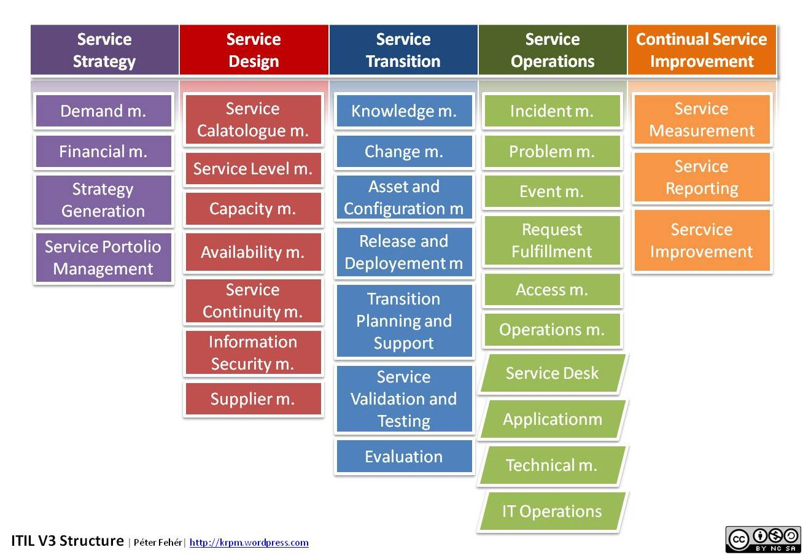
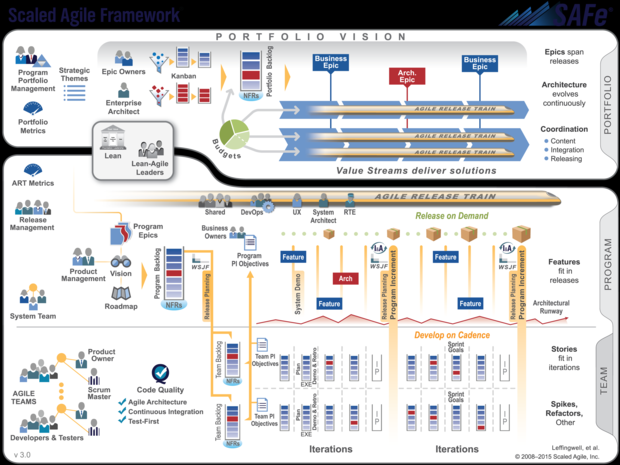
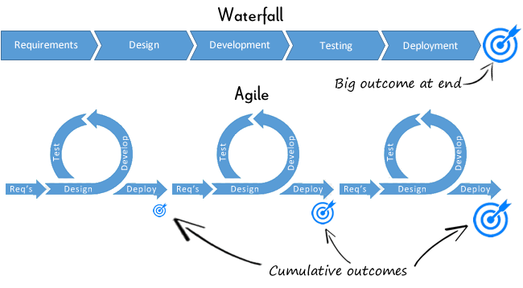
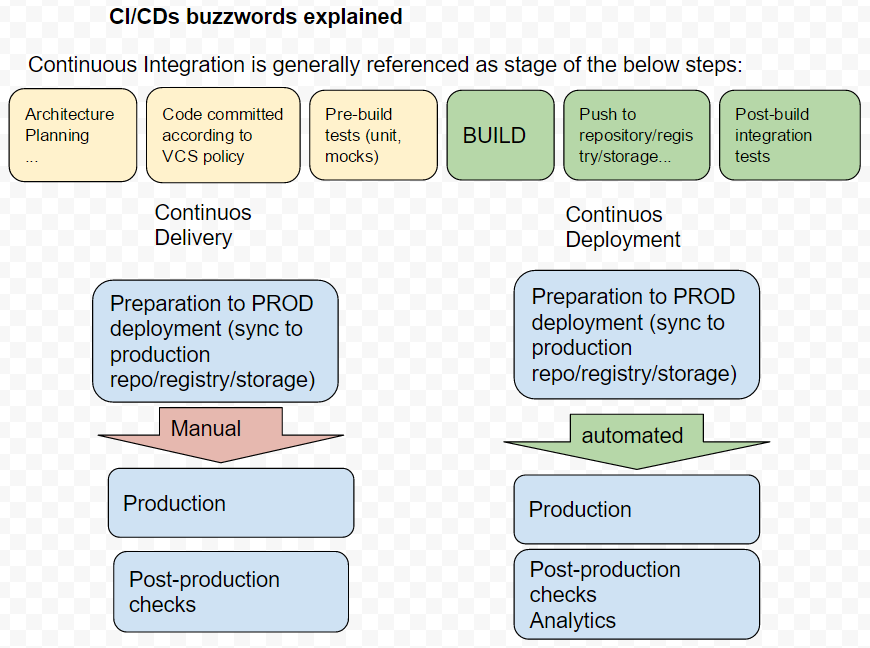
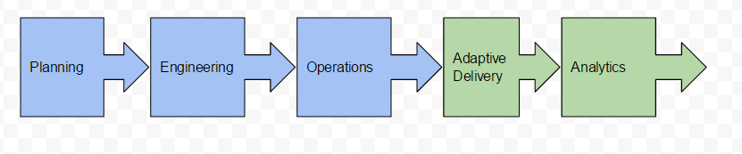

## Introduction to software development methodologies:
https://www.smartsheet.com/agile-vs-scrum-vs-waterfall-vs-kanban

### Operation strategies comparison
#### Operation frameworks
 - ITIL/ITSM
 
 
 
 
 
( Planned - Process Based - Procedure Based- Waterfall/Sequenced )

#### Common software delivery methodologies
 - Scrum, Kanban, SAF
 
 
  
  
  
( Iterative - Incremental - Collaborative - Lean/Agile )

## DevOps intro
###### DevOps set of practices of operations and development engineers participating together in the entire service lifecycle, from design through the development process to production support.

## Why DevOps and Agile?

## DevOps Values and Principles: 
 Agile DevOps Values: http://agilemanifesto.org/
 
 DevOps Principles:
 - Satisfy the customer
 - Welcome changing requirements
 - Delivery of working functionality frequently
 - NFR are important
 - Infrastructure as code
 - Provide all the needed support to each team
 - Progess is delivered working software
 - Technical excellence
 - KISS principle
 - Best design comes from self-organized teams
 - Regular retrospecitive and development

## DevOps Practices 
 - Cooperation in with stakeholders
 Developers, operations staff, and support people must work closely together on a regular basis to get real-time feedback on product needs.
  
 - Automated Testing 
 
 Encourage usage of TDD/BDD, provide options for fase and effective testing to QA teams.
  
 - Configuration Management
 Software need to be aware of the configuration model.
  
 - Change Management
  
 - Continuous Integration
 Continuous integration (CI) is the discipline of building and validating a project, through automated regression testing and code analysis.
 
 
 
   
 - Continuous Deployment

 
   
   
 - Deployment Planning 
 From the point of view of development teams, deployment planning has always required interaction with an organization's operations staff; in some cases, via liaison specialists within operations typically called release engineers.  
 
 - Production Support
  
 - Application Monitoring
   
 - Application Monitoring

 - Toolchain
 
#### Emerging practices
- Adaptive feature delivery
- Containers In Production
- Scaling 
- Complementary to marketing and sales campaigns

#### Deployment specific practices
- Blue-greep deploymne

## Modern DevOps operating solutions architecture patterns
#### DevOps team should work closely with stakehodlers and help with architecture definition and deployment implementation. 
#### Common patterns:
- SOA and microservices
- Distributed and highly-scaleable, upon demand.
- Build to change vs last
- Well established separation of concerns
- Data partitioning that fits architectural needs, multiple engines and databases
- Loosely-coupled
- Integration with processing systems, applications, message queues
- Synchronous as well as asynchronous processing

## DevOps Toolset

### Communication
- Slack
- HipChat
- Jostle
- Trello
- Asana
- ... 

### Agile/ITIL
- JIRA :)
- ServiceNow
- ... stick with leaders.

### Continuous Integration
- Jenkins
- GitLab CI
- TeamCity
- TravisCI
- ...

### Infrastructure as a Service
- Amazon Web Services
- OpenStack (RackSpace & co)
- Azure
- ...

### Configuration Management
- Chef
- Ansible
- Salt
- Puppet
- ...

### Virtualization Platforms
- VMware
- KVM
- Xen
- VirtualBox
- Vagrant
- ...

### Containerization
- Docker (Swarm, k8s)
- LXC
- Solaris Containers
- ... write your own here :)

### Logging
- ELK
- Splunk
- ... 

### Monitoring, Alerting, and Trending
- Graphite
- ELK 
- DataDog
- New Relic
- Nagios
- Cacti
- Sensu
- ...

## Materials
- https://github.com/CSC-DevOps/Course
- https://github.com/kahun/awesome-sysadmin
- https://www.youtube.com/watch?v=esEFaY0FDKc
- https://www.youtube.com/watch?v=TluNmn568dQ
- https://dzone.com/articles/devops-20
- https://leanpub.com/the-devops-2-toolkit/read
- http://shop.oreilly.com/product/0636920041528.do
- https://theagileadmin.com/what-is-devops/
- https://github.com/maximilien/devops/blob/master/docs/releases/CF%20DevOps%20Best%20Practices_v0.2.0.pdf
